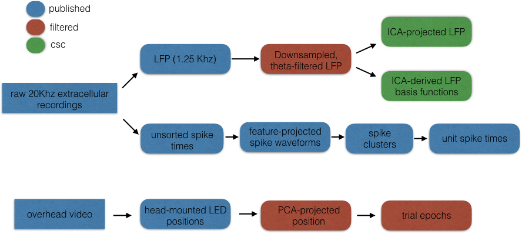
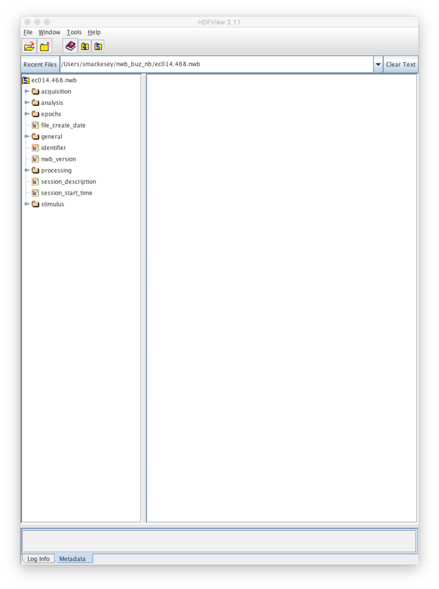
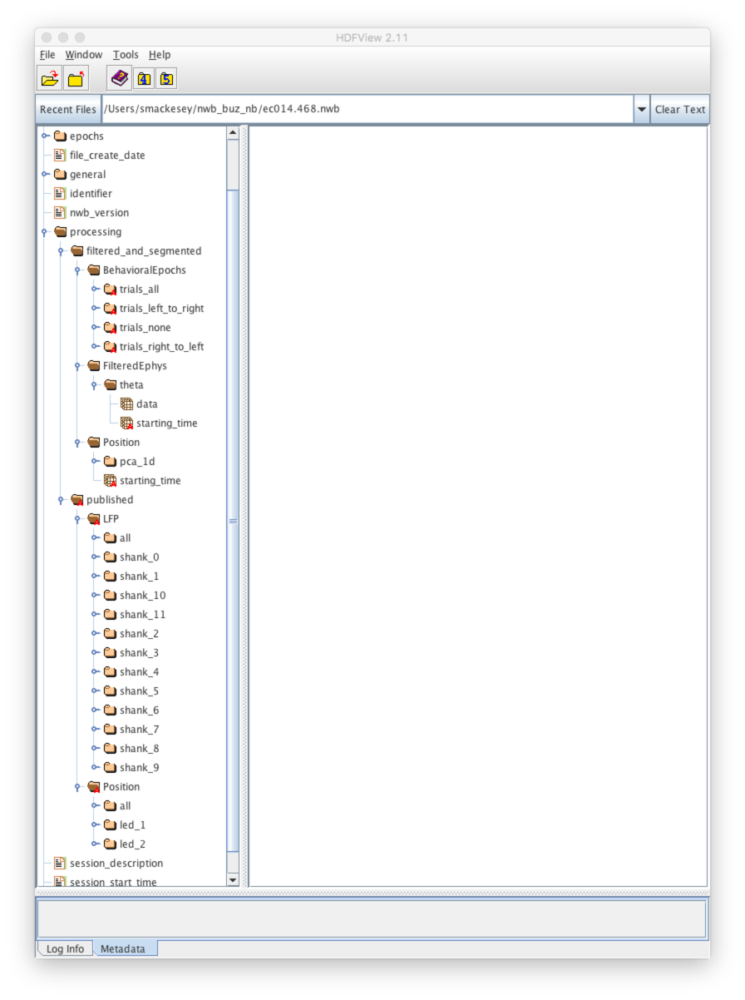

# Notebook

Welcome to the Neurodata Without Borders (NWB) format official tutorial! NWB is a format for publishing and exchanging neuroscience data. The purpose of this tutorial is to demonstrate how to read and write data to NWB files. We will cover:

- the layout of an NWB file
- the primary NWB abstractions: `Module`, `Interface`, and `TimeSeries`
- NWB schemas and extensions
- the official NWB API

We will explore these concepts by analyzing some rodent hippocampal data and appending the result to an existing NWB file. 

## Software Dependencies

This tutorial requires the following software:

- [NWB API](https://github.com/NeurodataWithoutBorders/api-python)
- [HDFView](https://www.hdfgroup.org/products/java/hdfview/), a graphical interface for browsing HDF5 files
- [Python](https://www.python.org/), version 2 or 3
- Python libraries:
    - [h5py](http://docs.h5py.org/en/latest/)
    - [scikit-learn](http://scikit-learn.org/stable/index.html)

## What is NWB for?

Neurophysiological data analysts are faced with many kinds of data. These may be divided into major types: (1) **metadata**, including subject type, device settings, experimental protocol and more; and (2) **primary data**, consisting of mainly numerical arrays. Metadata is sometimes descriptive of an entire experiment (e.g. subject characteristics), and sometimes descriptive of one or more specific arrays (e.g. stimulus descriptions for an array that numerically codes stimuli).

The aim of NWB is to place these diverse data within a single coherent structure. The established HDF5 format provides a solid, well-tested foundation; NWB thus defines a structure within the constraints of the familiar, filesystem-like hierarchy already provided by HDF5. The design principles informing this structure include:

- **human-readability**: Names of individual data elements should be comprehensible rather than cryptic. Deep hierarchies should be avoided where possible.
- **machine-readability**: the structure should be sufficiently constrained that APIs can be written against broad sets of NWB files
- **extensibility**: users can easily add new kinds of data to the format
- **one file per session**: individual NWB files should represent a single experimental "session", defined as a contiguous span of time.

To satisfy these principles, NWB strikes a balance between standardization and flexiblity. High and low-level file structures are fixed, but the medium level is free to vary. As we will see below, all NWB files contain the same top-level directories. You can always expect to find session-level metadata in the same location. Complex metadata (e.g. electrode maps) have a standard structure. And because most primary data are time series, NWB also provides a standard structure for time series. The choice of how to arrange the primary data is largely left up to individual users. This flexibility permits a single file to represent many possible data processing graphs.

## Tutorial Overview

In this tutorial, we will demonstrate one recommended way of using NWB. This method entails adding successive **modules** to a single file, with each module encapsulating a coherent set of data. We will work with data from one of the founding NWB datasets ([Buzsaki hc-3](https://crcns.org/data-sets/hc/hc-3)). The data are extracellular recordings from a rat running back and forth on a linear track to obtain a water reward. Embedded in the hippocampal formation are two different multielectrode arrays, each having 4 shanks, with each shank having 8 recording sites ("channels"). We only use a single session here, but the data from many similar sessions is hosted on [CRCNS](https://crcns.org/data-sets/hc/hc-3).

Working through the tutorial will give you experience working with the NWB API and reading, writing, and browsing an NWB file. Specifically, we are going to project the LFP into a new space (identified with independent component analysis) and segment the temporal dimension of the data into distinct trials (passes of the linear track). We will plot the projected LFP against animal position to reveal LFP features that selectively activate in specific locations across trials (behavior analogous to that of hippocampal place cells). Along the way, we will write our results and useful intermediates to the NWB file we start with. Because some of the data we will generate does not fit into pre-defined NWB structures, we will need to define an **extension** using the *specification language*.

Figure \ref{fig:flow_chart} shows a data processing graph. Each node represents a numerical array, and is colored according to the module to which it belongs. Blue nodes belong to the "published" module, which contains data elements published on CRCNS. Red nodes belong to "filtered", and contain further processed forms of the data. Green nodes belong to "ica", and contain results from independent component analysis. In this tutorial, we will begin with a special file containing both "published" and "filtered", and add "ica".



The specific steps we will take are:

- review the contents of the NWB file
- load the LFP and position data (with `h5py`)
- perform independent component analysis on the downsampled, filtered LFP
- plot the energy of basis functions learned through ICA against trial and position
- create a new `Module` to hold our analysis results
- write the projected representation of the LFP to an `Interface` within the new `Module`
- write the segmented trial information to an `Interface` within the `Module`
- describe the new `Interfaces` with a schema written in the [NWB Specification Language]{T:link}
- validate our modified file

Because the focus of this tutorial is on the mechanics of LFP files, rather than analysis, most of the code has been placed into an external module `buzsaki_hc`. 

### (1) Review the Contents of the NWB File

First, let's orient ourselves to the structure of NWB. Open `ec014.468.nwb` with HDFView. You should see this:



Notice that there are 5 top-level datasets and 6 top-level groups. While most metadata is stored in the `/general` group, there are a few items that were judged important enough to include at the top level. These are the datasets:

- `file_create_date`: timestamp for the creation of this NWB file
- `identifier`: globally unique identifier for this NWB file
- `nwb_version`: version number for this NWB file
- `session_description`: a summary of the experiment that yielded the data stored in this file
- `session_start_time`: the absolute time at which the session began

The 6 groups contain the following kinds of data:

- `/acquisition`: Directly recorded data streams
- `/analysis`: free-form, unspecified data analysis products; intended for internal use, not publication. Published analysis products should be placed in a processing `Module` in `/processing`, with an accompanying `schema`.
- `/epochs`: Time slices of the experiment (e.g. subexperiments, trials)
- `/general`: Experimental metadata (e.g. protocol, notes, description of hardware)
- `/processing`: Data analysis products. `/processing` has a special structure that we cover in more detail below.
- `/stimulus`: Data pushed into the system (e.g. video stimulus, sound, voltage, etc) and/or secondary representations of that data (e.g. measurements of something used as a stimulus)

More details about these groups can be found in the [official documentation](http://neurodatawithoutborders.github.io/docs). In this tutorial, we are interested only in the contents of `/processing`. `/acquisition`, `/epochs`, and `/stimulus`, are empty for our session (the raw data would normally be present in `/acquisition`, but we do not provide it in order to keep the file size small).

#### /processing

The contents of `/processing` have the most complex structure in NWB. This is because `/processing` is intended to contain machine-readable representations of arbitrary analysis products. The contents of `/processing` are always a three-level hierarchy. A particular NWB abstraction corresponds to each level of the hierarchy.

- `Modules` are stored at the top-level of `/processing`. A `Module` is just an HDF5 group that declares its contents in an attribute `interfaces`. Because a `Module's` internal structure is fully described by the listed interfaces, `Modules` are not declared in a specification and may be named arbitrarily.
- `Interfaces` are the top-level contents of `Modules`. `Interfaces` are groups that contain a specific set of subgroups and/or datasets. Most interfaces contain one or more `TimeSeries` and related metadata. The contents of the `Interface` must be declared in the file's schema. Thus the name of the `Interface` group must match:
    - an entry in the containing `Module's` `interfaces` attribute 
    - an `Interface` declaration in the file's schema
- `TimeSeries` are found inside `Interfaces` (and other places in an NWB file). A `TimeSeries` is a group that contains a time series and associated metadata. All `TimeSeries` are instances of an associated `TimeSeries` class, which is part of a hierarchy analogous to that of object-oriented programming languages. The core `TimeSeries` hierarchy is defined in the core NWB schema. It provides a set of `TimeSeries` intended to cover a broad range of data types. All `TimeSeries` must provide two key datasets:
    - `data`: contains the time-aligned data. Time must be on the first axis.
    - `timestamps` or `starting_time`: `timestamps` is a 1-dimensional dataset containing a timestamp for each row of `data`. These timestamps are relative to the experiment start time. Alternatively, `starting_time` is a single timestamp (also relative to experiment start time) that stores the start of the `TimeSeries`. `starting_time` must have an attribute `rate` which gives the sample rate. This allows the full list of timestamps to be derived from `starting_time`.

Now that we've reviewed the general structure of `/processing`, let's have a look at our file's `/processing` folder. Click on `/processing` in HDFView to examine its contents. You should see 2 groups inside: `published` and `filtered`. These are `Modules`. Click on `published`. Notice that its `interfaces` attribute (visible in the bottom pane of HDFView) has 6 entries: `Clustering`, `EventWaveform`, `FeatureExtraction`, `LFP`, `Position`, and `UnitTimes`. There is a subgroup corresponding to each entry. `Clustering`, `EventWaveform`, `FeatureExtraction`, and `UnitTimes` contain spike-related information. You can learn more about them in the [NWB docs](https://github.com/neurodatawithoutborders.github.io/docs). In this tutorial, we are concerned only with LFP and Position.



Click on `LFP` to examine it. `LFP` is a built-in interface type-- it is defined in NWB's core schema. It must contain one or more instances of the `TimeSeries` class `ElectricalSeries`.   inside `LFP`,you should see 13 groups: `all`, `shank_1`, `shank_2`, ..., `shank_12`. `all` contains the LFP recorded from all 64 electrodes. The `shank_<N>` groups contain HDF5 region references into the `all` dataset (corresponding to the channels on each shank). They are provided for convenience. Note that the `LFP` interface definition does not require this particular internal structure; it just requires one or more `ElectricalSeries`.


Now let's find the position. The position representation we will use is a product of processing overhead video of the experiment. The subject had two LEDs mounted on its head; the X and Y coordinates of each LED were extracted. Like `LFP`, `Position` interface is defined in the NWB core schema. It must contain one or more `TimeSeries` of class `SpatialSeries`. Also like `LFP`, our `Position` interface includes an `all` timeseries, containing the coordinates of both LEDs, and `led_1` and `led_2`, which are region references to the coordinates of each separate LED.


Because we are concerned with theta-band (5-10 Hz) activity in this tutorial, we need a filtered form of the LFP. We also need a one-dimensional representation of the position. These data (the red nodes in Figure \ref{fig:flow_chart}) have been included with this tutorial's NWB file in `/processing/filtered`. This module contains `BehavioralSegments`, `FilteredEphys` and `Position` interfaces. `BehavioralSegments` contains an `IntervalSeries` containing temporal boundaries for each traversal of the track. `FilteredEphys` contains a downsampled, bandpass-filtered version of the LFP. `Position` contains a `SpatialSeries` with a one-dimensional version of the position, obtained through principal component analysis.


### (2) load the LFP and position data

Now that you've explored the structure of our file, we're ready to work with some data. Let's load the LFP into memory. At present, NWB does not have a read API. Therefore we will use Python's mature HDF5 interface library `h5py`. First we need to create an `h5py` `File` object. Because we will be adding to the source file, you should open it in `'r+'` mode:

```python
import h5py
data = h5py.File('ec014.468.nwb', 'r')
```

For the remainder of this tutorial, we will read our NWB file through the `File` object `data`. Now let's load the LFP time series. `h5py` provides it as a `Dataset` object that behaves similarly to a `numpy` array.

```python
lfp = data['/processing/filtered/FilteredEphys/theta/data']
```

The matrix now stored in `lfp` is the primary `data` field of a `TimeSeries`. The shape is `(4947125,99)`. The first dimension is time, and the second is channel number. Time is always the first dimension for NWB TimeSeries. Notice that there is also a `starting_time` dataset inside `all`. Its `rate` attribute tells us that the sample rate is 1250 Hz. Thus the temporal extent of our LFP data is 4947125/1250 = 3,965.6 seconds, or approximately 66 minutes.

Now let's load `position`:

```python
pos = data['/processing/filtered/Position/pca_1d/data']
```

The shape of `pos` is `(152246,4)`. Like `lfp`, the first dimension of `pos` represents time. The second dimension contains two pairs of X and Y coordinates that capture the position of two LEDs mounted on the head of the subject. Though `pos` and `lfp` are aligned to the same timebase, notice that the temporal dimension of `pos` is much smaller than that of of `lfp`. This is because `pos` is sampled at a much lower rate than `lfp`; 39.0625 Hz, according to `Position/all/starting_time.rate`.

## (3) Perform independent component analysis on the LFP

Independent Component Analysis is a technique for separating a multivariate signal into a set of additive components. Beginning with a set of observed signals, we model our signal at each time point as a linear combination of fixed basis functions. The contributions of the individual basis functions are assumed to be statistically independent. You can learn more about ICA [here](http://www.stat.ucla.edu/~yuille/courses/Stat161-261-Spring14/HyvO00-icatut.pdf). The model can be summarized as:

$$X = AS$$

Where $X$ is the "observed signal", $A$ is the "mixing matrix" (whose columns are the aforementioned basis functions), and $S$ is the "source signal" (with each row correpsonding to the coefficients for one basis function).

Here, our observed signal is the all-channel filtered LFP that we have loaded into `lfp`. The basis functions extracted from applying ICA to LFP signals have no straightforward physiological interpretation. However, when the LFPs are taken from the hippocampus of navigating rats, some of the basis functions behave like place cells; that is, their activities (given by the learned coefficients) are correlated to particular locations in the environment.

We call the `bhc` module to perform ICA for us. This yields two matrices: `sources` and `components`. Sources is $S$ in the model above, and components is $A^{-1}$.

```python
sources, components = bhc.lfp_ica(filt_lfp)
```

## (4) Plot Component Activation vs Position

We now have our ICA-derived representation of LFP and trial-separated position. We can visualize the relationship of feature activation to position using heat maps of the feature coefficients. In the grid of plots below, each row corresponds to one basis function. The left column corresponds to leftward trials, and the right column to rightward trials. Within each plot, the x-axis represents position and the y-axis represents trial number. The pixel value represents the average coefficient value at the corresponding position and trial. Thus, light-colored columns (as visible in BFs 2 and 3) represent consisent selectivity of a basis function for a particular location. This is the same behavior we see with place cells.

```python
bhc.plot_source_heatmaps(sources, trials)
```

## (5) Write an extension to describe the structure of the analysis results

While this run of ICA was quick, other analyses can take a long time. Sometimes we want to save our results along with the source data. Here, we will 

Now that we have the mixing matrix and coefficients, we need to write them to the NWB file. But where? How do our mixing matrix and coefficient series map into NWB? A core concept in NWB is the `TimeSeries` hierarchy {T: link}. The NWB core does not define a `TimeSeries` type suitable for representing our ICA results. Therefore, we have defined a new `TimeSeries` type, `DictionarySeries`, in our extension. In a `DictionarySeries`, a set of basis functions is stored as columns of `dict` and the primary `data` field contains the coefficients for each basis function at each time point:

```json
{
  "fs": {
    "buzsaki_ica": {
      "IndependentComponentAnalysis/": {
        "merge": ["<Interface>/" ],
        "description": "An MxN storing a set of components (inverse of the mixing matrix) learned through Independent Component Analysis",
            "attributes": {
              "help?": {
                "data_type":"text"
      }
    }
  }
}
```

We now write the result of our ICA analysis to a new `DictionarySeries` with `h5py`. As per the NWB specification, our `DictionarySeries` is represented as an HDF5 group. We mark it as a `DictionarySeries` by filling in the `ancestry` attribute. Note that the specification requires that we provide all ancestors in this field, so we also list `TimeSeries`. We provide a variety of other required elements of the `DictionarySeries`, as defined by our extension file and the inherited requirements from the root `TimeSeries` type. Because this is a tutorial, we show the explicit creation of each element; however, normally one would call an API that would hide the details of these operations.

## (6) Writing analysis products to a new `Module`

The final step is to write our analysis products to the NWB file. We will put our data in a new `Module`. We'll call it `trial_ica`. As described above, `Module`s document their contents by listing the `Interfaces` they contain. We will populate `ffp_analysis` with two `Interfaces`; one for decomposed LFP and one for trial segments. However, the NWB core schema does not define appropriate interfaces for these two data types. We'll need to define our own in a separate schema.

```python
g = data.create_group('/processing/lfp_ica')
g['data'] = ica_coeff
g['dict'] = ica_mix
g.attrs['ancestry'] = [ 'TimeSeries', 'DictionarySeries' ]
g.attrs['description'] = "ICA decomposition of LFP at /processing/lfp"
g.attrs['neurodata_type'] = 'TimeSeries'
g.attrs['source'] = '???'  # TODO
g['data'].attrs['conversion'] = '???'  # TODO
g['data'].attrs['resolution'] = '???'  # TODO
g['data'].attrs['unit'] = '???'  # TODO
g['num_samples'] = '???'  # TODO
g['starting_time'] = s['starting_time']
g['starting_time'].attrs['rate'] = s['starting_time'].attrs['rate']
```

We have now written to the file.

### (7) Conclusion

This concludes the tutorial. For more information about NWB, check out [](http://www.nwb.org/).
